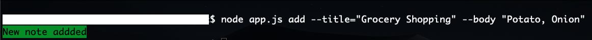
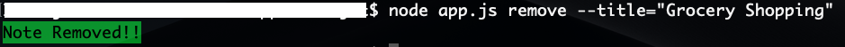
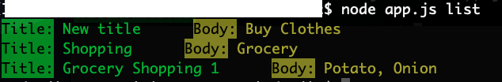
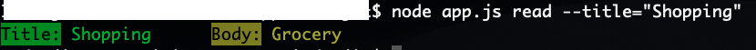

# Notes-App
A simple node CLI application that helps to add, create, delete and read notes. 

Adding Notes:

Removing Notes:

Listing all Notes:

Read a Particular Note:

Title: Specifies the title of the note. 
Body: Specifies the content.
